<div align="center">



<br/>

[](https://www.linkedin.com/in/brayan-camilo-clavijo-gomez-07538a152/)
[](mailto:bclavijogomez@gmail.com)
[](https://brayan-clavijo.vercel.app)


</div>

---

## whoami

```bash
$ cat dev.profile
```

```
nombre     : Brayan Camilo Clavijo Gómez
rol        : Mobile & Backend Developer
exp        : +2 años en producción
stack      : Flutter · Django · PostgreSQL · AWS
base       : Villavicencio, Colombia 🇨🇴
docencia   : Arquitectura de Software con Microservicios @ universidad
enfoque    : código que escala, no solo que funciona en el demo
```

Construyo aplicaciones reales — sincronización offline, notificaciones en tiempo real, autenticación robusta, dashboards con datos reales. No prototipos de presentación.

```
filosofía:
  → código mantenible > código inteligente
  → arquitecturas que escalan sin romper
  → documentación como parte del código, no como extra
```

---

## stack

### mobile


### backend


### infra & devops


---

## arquitectura que manejo

```
Mobile (Flutter)                    Backend (Django)
────────────────────────            ──────────────────────────
Clean Architecture          ←→      REST API + DRF
BLoC / GetX / Provider              JWT + refresh token rotation
Offline-first (SQLite)              PostgreSQL + migrations
Push Notifications                  Celery (tareas async + beat)
Google Maps SDK                     AWS S3 + EC2
Firebase Auth / Storage             Nginx + Gunicorn

CI/CD                               Observabilidad
────────────────────────            ──────────────────────────
GitHub Actions                      Logs estructurados
Docker multi-stage builds           Health checks por servicio
Deploy automatizado en push         Variables de entorno por env
```

---

## proyectos en producción

### Chilasi — reporte de emergencias en tiempo real

App móvil para reporte y gestión de emergencias. Diseñada para funcionar en zonas sin conexión.

```
problema   : coordinación lenta en emergencias por dependencia de señal
solución   : app offline-first con sincronización automática al reconectar
resultado  : reportes en < 3 taps · actualizaciones en vivo para coordinadores
```

**decisiones técnicas relevantes:**
- SQLite local con cola de sincronización priorizada por criticidad
- WebSocket para actualizaciones en tiempo real cuando hay señal
- Google Maps con tiles cacheados para zonas sin internet
- Push notifications segmentadas por rol (coordinador / campo)

`Flutter` `Dart` `Firebase` `Google Maps` `SQLite` `Provider` `WebSocket`

---

### AFI Asesorías Plus — gestión de calidad en salud

Plataforma para el sector salud y farmacéutico. Automatiza seguimiento regulatorio, riesgo farmacéutico y planes de mejoramiento.

```
problema   : seguimiento manual de registros INVIMA y permisos sanitarios
solución   : sistema automatizado con alertas, dashboards y app companion
resultado  : reducción de tareas manuales en gestión de calidad institucional
```

**decisiones técnicas relevantes:**
- Celery Beat para alertas programadas de vencimientos regulatorios
- DRF con permisos por módulo (calidad / riesgo / mejoramiento)
- Dashboard con reportes exportables en PDF y Excel
- App Flutter companion para acceso en campo sin abrir el navegador
- AWS S3 para almacenamiento de documentos regulatorios

`Django` `DRF` `PostgreSQL` `Flutter` `Celery` `AWS` `Push Notifications`

---

## repos con estrella

<!-- STARRED_START -->
| repositorio | descripción | lenguaje | stats |
|-------------|-------------|----------|-------|
| [Api-Rest-Spring-boot](https://github.com/clavijo99/Api-Rest-Spring-boot) |  |  | ⭐ 1 |
| [POO-ParcialF-project](https://github.com/YefrxxJPG/POO-ParcialF-project) |  |  | ⭐ 1 |
| [Project](https://github.com/yesicablum/Project) |  |  | ⭐ 2 |
| [sample_application_flutter](https://github.com/JeanmartinPV/sample_application_flutter) |  |  | ⭐ 78 · 🍴 26 |
| [flutter-samples](https://github.com/diegoveloper/flutter-samples) | Flutter Samples |  | ⭐ 3211 · 🍴 739 |
| [flutter_side_menu_animation](https://github.com/diegoveloper/flutter_side_menu_animation) |  |  | ⭐ 56 · 🍴 15 |
| [portfolio](https://github.com/diegobrice/portfolio) |  |  | ⭐ 6 |
| [emmanuel-mendez-react](https://github.com/emmanuel-mendez/emmanuel-mendez-react) | Emmanuel Méndez portfolio |  | ⭐ 2 |
| [flutter_network_layer](https://github.com/Richa0305/flutter_network_layer) |  |  | ⭐ 23 · 🍴 8 |
| [Welcome-Login-Signup-Page-Flutter](https://github.com/abuanwar072/Welcome-Login-Signup-Page-Flutter) | Mobile app onboarding, Login, Signup page with #flutter. |  | ⭐ 1338 · 🍴 862 |
<!-- STARRED_END -->

---

## stats

<div align="center">


</div>

<div align="center">


</div>

<div align="center">


</div>

---

## aprendiendo ahora

```bash
$ git log --oneline --learning
```

```
[en curso]  FastAPI       → microservicios más rápidos que DRF para endpoints de alta carga
[en curso]  Riverpod      → reemplazo de Provider con mejor manejo de estado reactivo
[explorando] Kafka        → event streaming para arquitecturas desacopladas
[explorando] Kubernetes   → orquestación cuando Docker Compose no escala
```

---

## contacto

Si tienes un proyecto en mente, buscas dev para tu equipo o quieres hablar de arquitectura:

<div align="center">

[](https://www.linkedin.com/in/brayan-camilo-clavijo-gomez-07538a152/)
[](https://brayan-clavijo.vercel.app)
[](mailto:bclavijogomez@gmail.com)

</div>

<div align="center">

*disponible para proyectos freelance · remoto · Colombia*

</div>